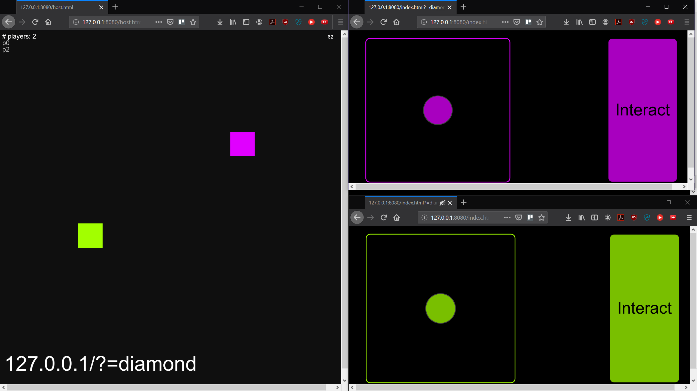
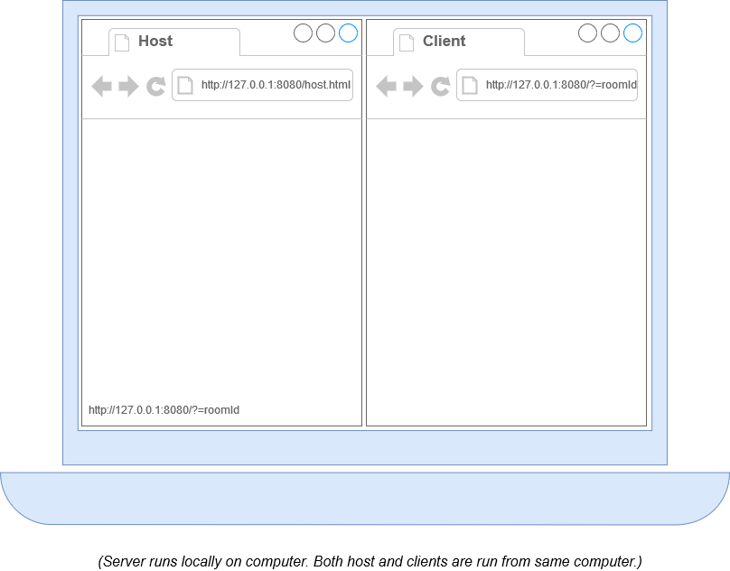
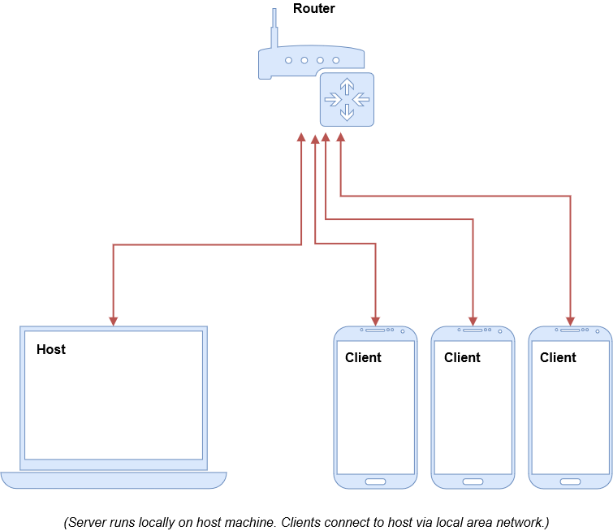
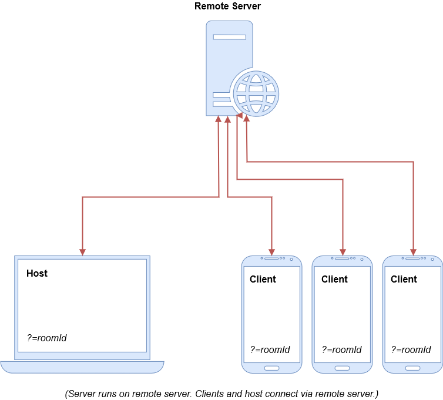

# p5.multiplayer

This repository contains a set of template files for building a multi-device, multiplayer game where multiple clients can connect to a specified host page. The clients and hosts are built using *[p5.js](https://p5js.org)*, and they communicate with each other through a *[node.js](https://nodejs.org/en/download/)* server via *[socket.io](https://socket.io/)* messages.

* [Getting Started](#getting-started)
* [How does it work?](#how-does-it-work)
    * [Local](#local)
    * [Local Area Network (LAN)](#local-area-network-lan)
    * [Remote Server](#remote-server)
* [Using the Template Files](#using-the-template-files)
* [Using p5.multiplayer with a Remote Server](#using-p5multiplayer-with-a-remote-server)
    * [Using with Glitch](#using-with-glitch)
        * [What is Glitch?](#what-is-glitch)
        * [Installation](#glitch-installation)
    * [Using with Heroku](#using-with-heroku)
        * [What is Heroku?](#what-is-heroku)
        * [Installation](#heroku-installation)

If you'd like to see an example video of this template in action, [check this out](https://vimeo.com/274410221).

## Getting Started
[[Back to top]](#p5multiplayer)

1. Clone this GitHub repo on your local machine.

2. If you don't already have *node.js* installed on your machine, go [here](https://nodejs.org/en/download/) and download the version appropriate for your operating system.

3. Open a terminal window and navigate to the project directory.

4. Run the command `npm install`.

5. Next, run the command `node server.js` to start a *node.js* server.

6. Open a second terminal window and navigate to the `public` folder within the project directory.

7. Run `http-server -c-1` to start server. This will default to port *8080*.

8. Open a browser and go to `http://127.0.0.1:8080/host.html`. This will open up a host page. Make note of the URL displayed in the bottom left corner of the screen.

9. Open a second browser and go to the URL displayed on your host page. It will look something like `http://127.0.0.1:8080/index.html?=roomId`, where `roomId` is a randomly generated name. This screen will load a controller that let's you control the movement of a colored square on the host page.

10. (OPTIONAL) The included *node.js* server cleverly lets you specify a custom room ID (think of it as a semi-private game room). You can specify your own room ID by opening a host page using `http://127.0.0.1:8080/host.html?=roomId`, where `roomId` is a string of your choice.

## How does it work?
[[Back to top]](#p5multiplayer)

*p5.multiplayer* functions by using a *node.js* server to relay data messages between a "host" and any "clients" that connect to it. The messages are sent using socket.io as the messaging protocol.

*p5.multiplayer* can be used in three possible configurations:

#### Localhost (Same computer)
[[Back to top]](#p5multiplayer)

This type of configuration works great for testing. You can run your *node.js* server on your local machine and test the "host" and "client" pages in separate browswer windows.

#### Local Area Network (LAN)
[[Back to top]](#p5multiplayer)

You can set up a multiplayer game or interactive installation on a local area network (LAN) that will enable multiple devices to connect to your machine. You'll need to know your machine's IP address and use that as your `serverIp` in order for this to work (how to find your IP address on [MacOS](https://www.macworld.co.uk/how-to/mac/ip-address-3676112/) / [Windows](https://support.microsoft.com/en-us/help/4026518/windows-10-find-your-ip-address)).

In your `host.js` and `index.js` files, set `const local = true`. Then change `const serverIp = 'yourIpAddress';` so that `yourIpAddress` matches your IP address.

You may also want to run your `http-server` on port `80` so that it's easier for clients to connect. To do this, follow the instructions in [Getting Started](#getting-started), but for step 7 you'll want to instead run `http-server -c-1 -p80`. 

Please be aware that your machine may be vulnerable whenever you allow other devices to connect to it.

#### Remote Server
[[Back to top]](#p5multiplayer)

This type of configuration is great for making sure as many devices as possible are able to connect to your server. In this case, the *node.js* server is hosted on a remote server and uses [Express](https://expressjs.com/) to serve the "host" and "client" pages to connected devices.

Please see the [directions below](#using-p5multiplayer-with-a-remote-server) for information on how to set this up.

## Using the Template Files
[[Back to top]](#p5multiplayer)

The `host.js`, `host.html`, `index.js`, and `index.html` files located within the `public` directory are a basic game example and should have everything you need to start building your own browser-based game.

They make use of two existing *[p5.js](https://p5js.org)* libraries: *[p5.touchgui](https://github.com/L05/p5.touchgui)*, which enables easy creation of mouse and touchscreen GUI elements, and *[p5.play](https://molleindustria.github.io/p5.play/)*, which enables easy creation of 2D sprite games within *p5.js*.

If you'd like to start with a completely blank template, however, please navigate to the `template` directory. You'll see comments indicating where to add your game logic and other related code bits that will customize the project to your own specifications. Once you've modified these to your liking, you can copy them into the `public` directory, overwriting the existing files of the same names.

## Using p5.multiplayer with a Remote Server

### Using with Glitch

#### What is Glitch?
[[Back to top]](#p5multiplayer)

[Glitch](https://glitch.com) is an approachable platform for creating web apps that let's users easily share, reuse, and repurpose code. You can use the service to create a dedicated URL for your game server instead of hosting it locally on your own machine. This will enable users to connect to a set URL from any device's browser as long as the device is connected to the internet, regardless of whether via ethernet, Wi-Fi, LTE, etc.

**Pros:**
* Can be accessed from any internet connected device.
* Dedicated URL for your own server.
* Free as long as you're within the platform [restrictions](https://glitch.com/help/restrictions/).

**Cons:**
* Not as fast as a local connection (i.e. your own computer, wireless router, etc.).
* Project are put to sleep after a relatively short period of time (see platform [restrictions](https://glitch.com/help/restrictions/)).
* Projects are subject to a connection limit per hour (see platform [restrictions](https://glitch.com/help/restrictions/)).
* You must create a Glitch account.
* A little bit extra setup (but hopefully the below steps make that easier!).

#### Glitch Installation
[[Back to top]](#p5multiplayer)

1. Create a free [Glitch](https://glitch.com) account if you don't already have one.

2. Once logged in, click *New Project > Clone from Git Repo*.

3. Copy the URL `https://github.com/L05/p5.multiplayer` and paste it where instructed to *Paste the full URL of your repository*.

4. You will be taken to an editor screen. If not, make sure to *Edit your project*.

5. Once in the editor, use the sidebar to go to the project's `public` directory. 

6. In your `host.js` and `index.js` files, set `const local = false` as you will be running these using a remote server. Then change `const serverIp = 'https://yourprojectname.glitch.me';` so that `yourprojectname` matches your Glitch project name. If you're not sure of what the URL should be, click *Show > In a New Window* at the top of the screen and a new browser window will open with the URL you should use.

7. Click *Show > In a New Window* to open a new browser window and add `host.html` at the end of the URL. It will look something like `https://yourprojectname.glitch.me/host.html`. You should see a "host" screen with *# players* in the top left of the window and a URL displayed in the bottom left corner. Make note of this URL.

8. In a second browser window, go to the aforementioned URL. You should see a "client" screen displaying a simple controller that lets you control a colored square in your "host" screen.

### Using with Heroku

#### What is Heroku?
[[Back to top]](#p5multiplayer)

[Heroku](https://heroku.com) is a cloud platform as a service that you can use to create a dedicated URL for your game server instead of hosting it locally on your own machine. This will enable users to connect to a set URL from any device's browser as long as the device is connected to the internet, regardless of whether via ethernet, Wi-Fi, LTE, etc.

**Pros:**
* Can be accessed from any internet connected device.
* Dedicated, persistent URL for your own server.
* Free as long as you're within the platform [limits](https://devcenter.heroku.com/articles/limits).

**Cons:**
* Not as fast as a local connection (i.e. your own computer, wireless router, etc.).
* You must create a Heroku account.
* Project are put to sleep after a period of time (see platform [limits](https://devcenter.heroku.com/articles/limits)).
* Projects are subject to a connection limit per hour (see platform [limits](https://devcenter.heroku.com/articles/limits)).
* A little bit extra setup (but hopefully the below steps make that easier!).

#### Heroku Installation
[[Back to top]](#p5multiplayer)

1. Make sure to first follow at least steps 1 through 4 in [Getting Started](#getting-started).

2. Create a free [Heroku](https://heroku.com) account if you don't already have one.

3. Open a terminal window and navigate to the project directory.

4. Create a Heroku app by running the command `heroku create yourservername`, replacing `yourservername` with a server name of your choice.

5. Go to the project's `public` directory and in your `host.js` and `index.js` files, set `const local = false` as you will be running these using a remote server. Then change `const serverIp = 'https://yourservername.herokuapp.com';` to match your Heroku server address.

6. Commit these updates. In the terminal, run the command `git add -a -m "Updating for Heroku deployment"`.

7. Next, in the terminal run the command `git push heroku master`. This will push your code to the remote Heroku server.

8. Open a browser window and go to `https://yourservername.herokuapp.com/host.html`, replacing `yourservername` with the server name you selected in step 4. You should see a "host" screen with *# players* in the top left of the window and a URL displayed in the bottom left corner. Make note of this URL.

9. In a second browser window, go to the aforementioned URL. You should see a "client" screen displaying a simple controller that lets you control a colored square in your "host" screen.

